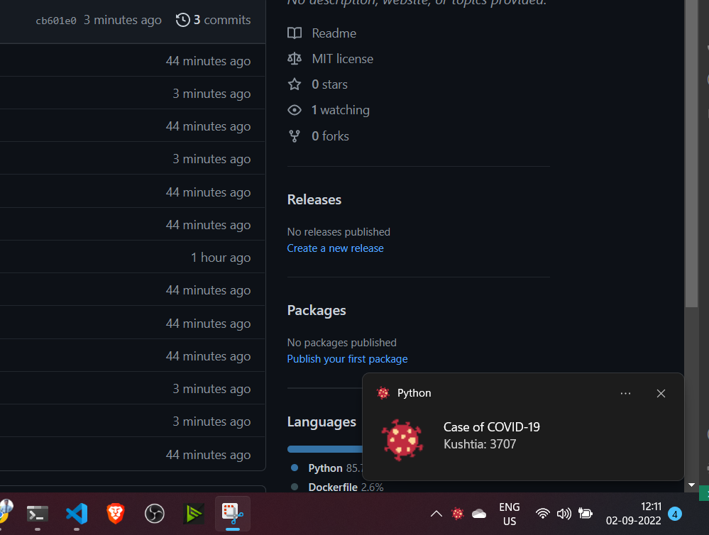

# Real-Time-Notification-System-of-COVID-19
Early detection of infectious diseases is crucial for reducing transmission and facilitating early intervention. In this prject, we built a real-time Notification-System-of-COVID-19 that notify the total case of covit in a particuler district 

# How to run?
### STEPS:

Clone the repository

```bash
https://github.com/entbappy/Covid19-Case-Real-Time-Notification-System.git
```
### STEP 01- Create a conda environment after opening the repository

```bash
conda create -n notify python=3.7.10 -y
```

```bash
conda activate notify
```


### STEP 02- install the requirements
```bash
pip install -r requirements.txt
```

### STEP 03- run app.py
```bash
python app.py
```


# Demo:




## Built With

1. bs4 
2. Python


## Authors
iNeuron Private limited
## License

This project is licensed under the MIT License - see the [LICENSE.md](LICENSE.md) file for details
